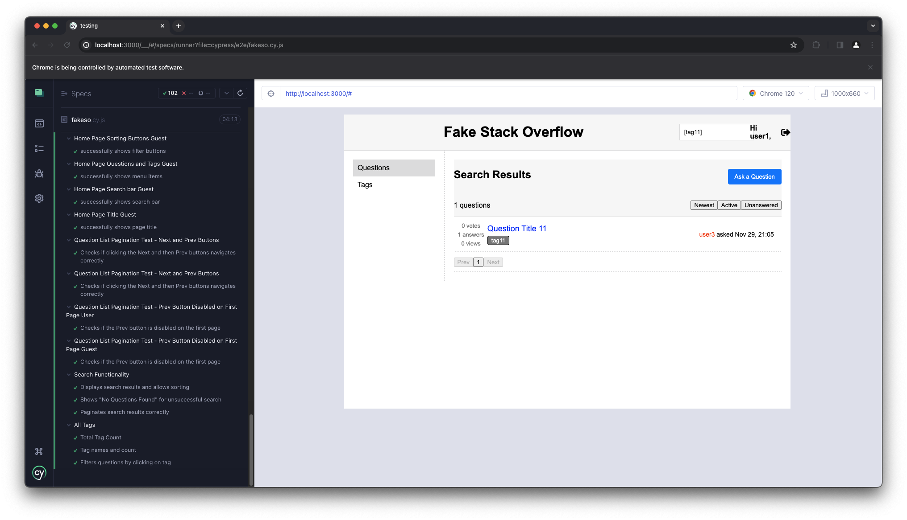

[](https://classroom.github.com/a/hxTav0v1)
Login with your Northeastern credentials and read the Project Specifications [here](https://northeastern-my.sharepoint.com/:w:/g/personal/j_mitra_northeastern_edu/EcUflH7GXMBEjXGjx-qRQMkB7cfHNaHk9LYqeHRm7tgrKg?e=oZEef3).

Add design docs in *images/*

## Instructions to setup and run project

After cloning the repository,
Assuming you are in the project root directory,
It is recommended that you open 2 terminals.  One for running client and one for running server.

-> Before starting the application, make sure mongodb is running.

**For Client:** 
```
cd client/
npm install
npm run start
```
**For Server:**
```
cd server/
npm install
node server.js
```

**For Testing:**
```
cd testing/
npm install
npx cypress open
```

**_Our Cypress already handles the creation and deletion of the database._**

[init.js](./server/init.js) Handles the creation of the database.

[destroy.js](./server/destroy.js) Handles the destruction of the database.


## Team Member 1 : Shubhang Kohirkar
- Home Page/ Questions
- Add New Questions Page
- Search Page
- Tags Page
- Debugging and Testing
- Conversion from JS to React
- Handling links for the new questions
- API calls for Questions and some Answers.
- Frontend redesign to support Async methods.
- Register, User Login.
- User Profile Workflow.
- API for Authentication and Sessions.
- API for User Profile.
- Question Upvote, Downvote.
- Tests related to built features

## Team Member 2 : Steffi Patel
- Answers Page
- Add New Answers Page
- UML
- Debugging and Testing
- Conversion from JS to React
- Handling links for the answers posted
- API calls for Tags and some Answers.
- Frontend redesign to support Async methods.
- Addition of Comments.
- Pagination for Questions, Answers & Comments.
- Guest Login
- All new changes in Answer Page
- Answers and Comments Upvote, Downvote
- Tests related to built features


## Test cases

| Use-case Name           | Test case Name |
|-------------------------|----------------|
| Home Page               | Displays votes for user         |
|                         | Displays votes for Guest         |
|                         | Home Page Questions User         |
|                         | Home Page AskQuestion Button User         |
|                         | Home Page Total questions User         |
|                         | Home Page Sorting Buttons User         |
|                         | Home Page Questions and Tags User         |
|                         | Home Page Search bar Guest         |
|                         | Home Page Title Guest         |
|                         | Home Page Questions Guest         |
|                         | Home Page AskQuestion Button Guest         |
|                         | Home Page Total questions Guest         |
|                         | Home Page Sorting Buttons Guest         |
|                         | successfully shows filter buttons         |
|                         | Home Page Questions and Tags Guest         |
|                         | Home Page Search bar Guest         |
|                         | Home Page Title Guest         |
|                         | Question List Pagination Test - Next and Prev Buttons         |
|                         | Question List Pagination Test - Prev Button Disabled on First Page User         |
|                         |  Question List Pagination Test - Prev Button Disabled on First Page Guest        |
| Login                   | Successfully Logged in        |
|                         | Successfully Logged in as a Guest        |
| Create Acc              | Successfully registers a new user         |
|                         | Validates password length during account creation         |
|                         | Validates required username during account creation         |
|                         | Validates required email during account creation         |
|                         | Validates required password during account creation         |
|                         | Validates password and confirm password match during account creation         |
|                         | Shows error for account creation with existing email         |
|                         | Shows error for account creation with existing username         |
|                         | Validates password does not contain username or email        |
| Logout                  | Successfully Logged out       |
| User Profile            | View User Profile        |
|                         | Displays User Information        |
|                         | Displays Questions Posted by the User & pagination        |
|                         | Displays Tags Created by the User       |
|                         | Displays Answers Created by the User & pagination        |
|                         | Allows Editing of a Question       |
|                         | Allows Editing of an Answer        |
|                         | Allows Editing of a Tag        |
|                         | Validates Tag Edit and Update       |
|                         | Validates Empty Tag Edit and Update        |
|                         | Allows Deletion of a Tag        |
|                         | Allows Deletion of a Question        |
|                         | Allows Deletion of an Answer        |
|                         | Check Reputation Increase        |
|                         | Check Reputation Decrease       |
| New Question            | new question post user        |
|                         | should show error when title is empty        |
|                         | should show error when question text is empty        |
|                         | should show error when more than five tags are entered        |
|                         | should show error for invalid hyperlink in question text       |
|                         | should show error for title longer than 100 characters        |
|                         | should show error for tag longer than 20 characters        |
| New Answer              | should show error when answer text is empty        |
|                         | should show error for invalid hyperlink in answer text        |
|                         | Checks if the correct number of votes is displayed for an answer        |
|                         | Add answer        |
| Comments                | Checks if a user can add a comment        |
|                         | Checks if a user can upvote a comment on an answer       |
|                         | Add Comment to Answer Test        |
|                         | Checks pagination for comments       |
|                         | Rejects a comment over 140 characters       |
|                         | Checks if a new comment can be added to an answer       |
| User Low Reputation     | Cannot Upvote a question       |
|                         | Cannot Downvote a question        |
|                         | Cannot Upvote an Answer        |
|                         | Cannot Downvote an Answer        |
|                         | Cannot Upvote a Comment        |
|                         | Cannot add comment        |
| Guest User              | Checks if "Ask a Question" button is disabled for a guest user        |
|                         | Checks if "Answer Question" button is disabled for a guest user        |
|                         | Displays guest username and login button in the header       |
| Question Activity tests | Answering a question makes it latest        |
|                         | Upvoting a Question        |
|                         | Downvoting a Question        |
|                         | Upvoting a Question reflects question activity        |
|                         | Downvoting a Question reflects question activity        |
|                         | Upvoting an Answer reflects question activity        |
|                         | Downvoting an Answer        |
|                         | Adding a Comment to an Answer        |
|                         | Adding a Comment to an Answer reflects question activity        |
|                         | Adding a Comment to Question reflects quesstion activity        |
|                         | Upvoting a Comment to Question        |
|                         | Upvoting a Comment to Answer        |
|                         | Reposting a Question in User Profile updates question activity        |
|                         | Reposting an Answer in User Profile updates question activity        |
| Answers                 |  Question Details Tags Test       |
|                         |  Accept Answer Test       |
|                         |  Accept Answer Pins the answer       |
|                         |  Checks if an answer can be accepted       |
|                         |  Answer Upvoting Test       |
|                         |  Checks if upvoting an answer increments the vote count       |
|                         |  Answer Downvoting Test       |
|                         |  Checks if downvoting an answer increments the vote count       |
|                         |  Question Upvoting Test       |
|                         |  Checks if upvoting a question increments the vote count       |
|                         |  Question Downvoting Test       |
|                         |  Checks if downvoting a question decrements the vote count       |
| Searching               |  Displays search results and allows sorting      |
|                         |  Shows "No Questions Found" for unsuccessful search       |
|                         |  Paginates search results correctly       |
| All Tags                |  Total Tag Count       |
|                         |  Tag names and count       |
|                         |  Filters questions by clicking on tag       |

## Design Patterns Used

- Design Pattern Name: Singleton
- Location in code where pattern is used: [logger.js](./client/src/logger/logger.js) & example where its used can be seen in [Content.jsx](./client/src/components/Content.jsx).

- Problem Solved: 


## Testcases Running 



## User credentials

The application can be manually tested by the users

Username : user1

Password : 123456

Username : user3 (Reputation < 50)

Password : 123456